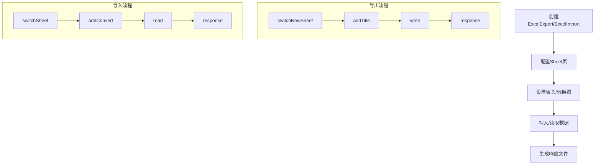

# Excel Utils Boot Starter

[](https://mvnrepository.com/artifact/cn.creekmoon/excel-utils-boot-starter)
[](http://www.apache.org/licenses/LICENSE-2.0.html)

一个基于 Hutool 的优雅易用的 Excel 导入导出工具，专为 Spring Boot 应用设计。

## 设计理念

- **易于使用** - 链式调用，三步完成导入导出
- **符合直觉** - API 设计贴近自然语言
- **降低心智负担** - 无需复杂配置，开箱即用
- **功能强大** - 支持多级表头、多 Sheet 页、样式设置、数据验证

## 快速开始

### 1. 引入依赖

```xml
<dependency>
    <groupId>cn.creekmoon</groupId>
    <artifactId>excel-utils-boot-starter</artifactId>
    <version>2.1.2</version>
</dependency>
```

> ⚠️ 从 2.0.0 版本开始，基于 Spring Boot 3.0 (JDK 17) 开发

### 2. 启用工具类

在 Spring Boot 启动类上添加注解：

```java
@EnableExcelUtils
@SpringBootApplication
public class Application {
    public static void main(String[] args) {
        SpringApplication.run(Application.class, args);
    }
}
```

## 导出场景

### 场景一：基础数据导出

最常见的需求：将用户列表导出为 Excel 文件

```java
@GetMapping("/export/users")
public void exportUsers(HttpServletResponse response) {
    // 准备数据
    List<User> users = userService.getAllUsers();
    
    // 三步完成导出
    ExcelExport.create()
        .switchNewSheet(User.class)
        .addTitle("用户名", User::getUsername)
        .addTitle("姓名", User::getFullName)
        .addTitle("邮箱", User::getEmail)
        .addTitle("注册时间", User::getCreateTime)
        .write(users)
        .response(response);
}
```

**生成效果：**
```
| 用户名    | 姓名     | 邮箱              | 注册时间          |
|----------|----------|------------------|------------------|
| zhangsan | 张三     | zhang@email.com  | 2024-01-01 10:00 |
| lisi     | 李四     | li@email.com     | 2024-01-02 14:30 |
```

### 场景二：多级表头导出

业务中经常需要对数据进行分类展示：

```java
@GetMapping("/export/sales")
public void exportSalesReport(HttpServletResponse response) {
    List<SalesData> salesData = salesService.getMonthlySales();
    
    ExcelExport.create()
        .switchNewSheet(SalesData.class)
        .addTitle("基本信息::销售员", SalesData::getSalesName)
        .addTitle("基本信息::所属部门", SalesData::getDepartment)
        .addTitle("业绩数据::本月销售额", SalesData::getCurrentAmount)
        .addTitle("业绩数据::累计销售额", SalesData::getTotalAmount)
        .addTitle("排名", SalesData::getRank)
        .write(salesData)
        .response(response);
}
```

**生成效果：**
```
|        基本信息        |        业绩数据        |      |
| 销售员   | 所属部门    | 本月销售额 | 累计销售额 | 排名  |
|---------|------------|-----------|-----------|------|
| 张三     | 华东区      | 50000     | 300000    | 1    |
| 李四     | 华南区      | 45000     | 280000    | 2    |
```

### 场景三：多工作表导出

一个文件包含多个相关数据表：

```java
@GetMapping("/export/comprehensive")
public void exportComprehensiveReport(HttpServletResponse response) {
    List<Student> students = studentService.getAllStudents();
    List<Teacher> teachers = teacherService.getAllTeachers();
    
    ExcelExport excelExport = ExcelExport.create();
    
    // 学生信息表
    excelExport.switchNewSheet(Student.class)
        .addTitle("学号", Student::getStudentNo)
        .addTitle("姓名", Student::getName)
        .addTitle("年龄", Student::getAge)
        .addTitle("专业", Student::getMajor)
        .write(students);
    
    // 教师信息表  
    excelExport.switchNewSheet(Teacher.class)
        .addTitle("工号", Teacher::getTeacherNo)
        .addTitle("姓名", Teacher::getName)
        .addTitle("学科", Teacher::getSubject)
        .addTitle("职称", Teacher::getTitle)
        .write(teachers);
    
    excelExport.response(response);
}
```

### 场景四：带样式的数据导出

根据业务规则突出显示重要数据：

```java
@GetMapping("/export/financial")
public void exportFinancialReport(HttpServletResponse response) {
    List<FinancialRecord> records = financialService.getMonthlyRecords();
    
    ExcelExport.create()
        .switchNewSheet(FinancialRecord.class)
        .addTitle("项目名称", FinancialRecord::getProjectName)
        
        // 盈利项目显示绿色
        .addTitle("收入金额", FinancialRecord::getIncome, 
                  ExcelCellStyle.LIGHT_GREEN, 
                  record -> record.getIncome() > 0)
        
        // 亏损项目显示橙色
        .addTitle("支出金额", FinancialRecord::getExpense,
                  ExcelCellStyle.LIGHT_ORANGE, 
                  record -> record.getExpense() > record.getIncome())
        
        // 多条件样式：根据净利润设置不同颜色
        .addTitle("净利润", FinancialRecord::getNetProfit,
                  ConditionCellStyle.of(LIGHT_GREEN, r -> r.getNetProfit() > 10000),
                  ConditionCellStyle.of(PALE_BLUE, r -> r.getNetProfit() > 0),
                  ConditionCellStyle.of(LIGHT_ORANGE, r -> r.getNetProfit() <= 0))
        
        .write(records)
        .response(response);
}
```

## 导入场景

### 场景一：标准数据导入

最常见的需求：从 Excel 文件导入用户数据

```java
@PostMapping("/import/users")
public void importUsers(MultipartFile file, HttpServletResponse response) {
    ExcelImport.create(file)
        .switchSheet(0, User::new)
        .addConvert("用户名", User::setUsername)
        .addConvert("姓名", User::setFullName)  
        .addConvert("年龄", IntegerConverter::parse, User::setAge)
        .addConvert("邮箱", User::setEmail)
        .addConvert("注册时间", DateConverter::parse, User::setCreateTime)
        .read(user -> {
            // 处理每一行数据
            userService.saveUser(user);
            log.info("导入用户: {}", user.getUsername());
        })
        .response(response);
}
```

### 场景二：数据验证与错误处理

实际业务中需要对导入数据进行验证：

```java
@PostMapping("/import/products")
public void importProducts(MultipartFile file, HttpServletResponse response) {
    ExcelImport.create(file)
        .switchSheet(0, Product::new)
        .addConvert("产品编码", Product::setProductCode)
        .addConvert("产品名称", Product::setProductName)
        .addConvert("价格", BigDecimalConverter::parse, Product::setPrice)
        .addConvert("库存数量", IntegerConverter::parse, Product::setStock)
        .read(product -> {
            try {
                // 业务验证
                if (productService.existsByCode(product.getProductCode())) {
                    throw new BusinessException("产品编码已存在");
                }
                if (product.getPrice().compareTo(BigDecimal.ZERO) <= 0) {
                    throw new BusinessException("价格必须大于0");
                }
                
                productService.saveProduct(product);
            } catch (Exception e) {
                log.error("导入产品失败: {}", e.getMessage());
                throw e; // 异常会被自动记录到导入结果中
            }
        })
        .response(response);
}
```

### 场景三：指定单元格读取

有时需要从固定位置读取特定数据：

```java
@PostMapping("/import/config")
public void importSystemConfig(MultipartFile file, HttpServletResponse response) {
    ExcelImport.create(file)
        .switchSheetAndUseCellReader(0, SystemConfig::new)
        .addConvert("B1", SystemConfig::setSystemName)      // B1 单元格
        .addConvert("D1", SystemConfig::setVersion)         // D1 单元格  
        .addConvert(2, 3, IntegerConverter::parse, SystemConfig::setMaxUsers) // 第3行第4列
        .read(config -> {
            systemConfigService.updateConfig(config);
        })
        .response(response);
}
```

### 场景四：导入结果验证与处理

在实际业务中，我们经常需要获取导入结果，进行后续的验证和处理：

```java
@PostMapping("/import/users-with-validation")
public ResponseEntity<ImportSummary> importUsersWithValidation(MultipartFile file, HttpServletResponse response) {
    ExcelImport excelImport = ExcelImport.create(file);
    
    // 获取导入结果对象
    TitleReaderResult<User> result = excelImport.switchSheet(0, User::new)
        .addConvert("用户名", User::setUsername)
        .addConvert("姓名", User::setFullName)
        .addConvert("年龄", IntegerConverter::parse, User::setAge)
        .addConvert("邮箱", User::setEmail)
        .read(); // 不传入Consumer，先获取所有数据
    
    // 获取所有成功解析的数据
    List<User> users = result.getAll();
    
    // 对每个用户进行业务验证
    for (User user : users) {
        try {
            // 业务验证逻辑
            if (userService.existsByUsername(user.getUsername())) {
                result.setResultMsg(user, "用户名已存在");
                continue;
            }
            if (!isValidEmail(user.getEmail())) {
                result.setResultMsg(user, "邮箱格式不正确");
                continue;
            }
            
            // 保存用户
            userService.saveUser(user);
            result.setResultMsg(user, "导入成功");
            
        } catch (Exception e) {
            result.setResultMsg(user, "保存失败: " + e.getMessage());
        }
    }
    
    // 生成带有验证结果的Excel文件
    excelImport.response(response);
    
    // 返回导入摘要
    ImportSummary summary = new ImportSummary();
    summary.setTotalCount(users.size());
    summary.setSuccessCount(users.size() - result.getErrorCount().get());
    summary.setErrorCount(result.getErrorCount().get());
    
    return ResponseEntity.ok(summary);
}
```

### 场景五：分批处理与进度反馈

对于大数据量导入，可以使用consume方法进行分批处理：

```java
@PostMapping("/import/bulk-products")
public void importBulkProducts(MultipartFile file, HttpServletResponse response) {
    ExcelImport excelImport = ExcelImport.create(file);
    
    AtomicInteger processedCount = new AtomicInteger(0);
    AtomicInteger successCount = new AtomicInteger(0);
    
    TitleReaderResult<Product> result = excelImport.switchSheet(0, Product::new)
        .addConvert("产品编码", Product::setProductCode)
        .addConvert("产品名称", Product::setProductName)
        .addConvert("价格", BigDecimalConverter::parse, Product::setPrice)
        .read()
        .consume((rowIndex, product) -> {
            try {
                // 业务处理
                productService.saveProduct(product);
                successCount.incrementAndGet();
                
                // 进度反馈（每100条记录输出一次）
                int processed = processedCount.incrementAndGet();
                if (processed % 100 == 0) {
                    log.info("已处理 {} 条记录，成功 {} 条", processed, successCount.get());
                }
                
            } catch (Exception e) {
                throw new BusinessException("第" + (rowIndex + 1) + "行处理失败: " + e.getMessage());
            }
        });
    
    // 输出最终统计
    log.info("导入完成：总计 {} 条，成功 {} 条，失败 {} 条", 
             processedCount.get(), successCount.get(), result.getErrorCount().get());
    
    excelImport.response(response);
}
```

### 场景六：多工作表导入

从一个文件的多个工作表导入不同类型的数据：

```java
@PostMapping("/import/school-data")
public void importSchoolData(MultipartFile file, HttpServletResponse response) {
    ExcelImport excelImport = ExcelImport.create(file);
    
    // 导入学生数据（第一个工作表）
    TitleReaderResult<Student> studentResult = excelImport.switchSheet(0, Student::new)
        .addConvert("学号", Student::setStudentNo)
        .addConvert("姓名", Student::setName)
        .addConvert("年龄", IntegerConverter::parse, Student::setAge)
        .read(student -> studentService.saveStudent(student));
    
    // 导入教师数据（第二个工作表）
    TitleReaderResult<Teacher> teacherResult = excelImport.switchSheet(1, Teacher::new)
        .addConvert("工号", Teacher::setTeacherNo)
        .addConvert("姓名", Teacher::setName)
        .addConvert("学科", Teacher::setSubject)
        .read(teacher -> teacherService.saveTeacher(teacher));
    
    // 输出导入摘要
    log.info("学生导入：成功 {} 条，失败 {} 条", 
             studentResult.getAll().size(), studentResult.getErrorCount().get());
    log.info("教师导入：成功 {} 条，失败 {} 条", 
             teacherResult.getAll().size(), teacherResult.getErrorCount().get());
    
    excelImport.response(response);
}
```

## 高级特性

### 样式配置

#### 内置样式

工具提供三种预定义样式：

```java
ExcelCellStyle.LIGHT_ORANGE  // 浅橙色背景
ExcelCellStyle.PALE_BLUE     // 浅蓝色背景  
ExcelCellStyle.LIGHT_GREEN   // 浅绿色背景
```

#### 自定义样式

```java
// 创建自定义样式
ExcelCellStyle customStyle = new ExcelCellStyle((workbook, style) -> {
    style.setFillForegroundColor(IndexedColors.YELLOW.getIndex());
    style.setFillPattern(FillPatternType.SOLID_FOREGROUND);
    // 设置数字格式
    style.setDataFormat(workbook.createDataFormat().getFormat("#,##0.00"));
});

// 应用样式
.addTitle("金额", Order::getAmount, customStyle, order -> order.getAmount() > 1000)
```

### 高级配置

#### 启用注解参数说明

```java
@EnableExcelUtils(
    customExceptions = {BusinessException.class},  // 自定义业务异常
    importMaxParallel = 4,                        // 最大导入并发数
    tempFileLifeMinutes = 5                       // 临时文件保留时间（分钟）
)
```

#### 数据转换器

系统提供多种内置转换器：

- `StringConverter` - 字符串转换（默认）
- `IntegerConverter` - 整数转换  
- `BigDecimalConverter` - 高精度数字转换
- `DateConverter` - 日期转换
- `LocalDateTimeConverter` - 本地日期时间转换

### 导入结果处理

#### TitleReaderResult 详解

`TitleReaderResult` 是导入操作的核心结果对象，提供了丰富的方法来处理导入结果：

```java
// 四种读取方式
TitleReaderResult<User> result1 = reader.read();                   				
TitleReaderResult<User> result2 = reader.read().consume(user -> process(user)); // 直接处理每行数据
TitleReaderResult<User> result2 = reader.read(user -> process(user)); 			// 直接处理每行数据
List<User> users = result.getAll();              								// 获取所有成功解析的数据
```

#### consume方法 vs 直接处理的关键区别

**使用consume方法的优势：**自动异常处理和结果记录

```java
// 使用consume - 推荐方式
result.consume(user -> {
    userService.save(user);  // 如果抛异常，会自动记录到结果中
    // 成功执行完毕，自动标记为"导入成功!"
});

// 直接处理 - 需要手动处理异常
List<User> users = result.getAll();
for (User user : users) {
    try {
        userService.save(user);
        result.setResultMsg(user, "导入成功!");  // 需要手动设置成功消息
    } catch (Exception e) {
        result.setResultMsg(user, e.getMessage()); // 需要手动设置失败消息
        result.getErrorCount().incrementAndGet();  // 需要手动增加错误计数
    }
}
```


**直接处理的适用场景：**需要复杂的业务逻辑判断

```java
List<User> users = result.getAll();
for (User user : users) {
    if (needsSpecialValidation(user)) {
        // 复杂的多步骤验证
        ValidationResult validation = complexValidation(user);
        if (validation.isSuccess()) {
            userService.save(user);
            result.setResultMsg(user, "特殊验证通过并保存成功");
        } else {
            result.setResultMsg(user, validation.getErrorMessage());
        }
    } else {
        // 简单保存
        userService.save(user);
        result.setResultMsg(user, "导入成功!");
    }
}
```

**总结对比：**

| 特性 | consume方法 | 直接处理getAll() |
|------|------------|------------------|
| 异常处理 | 自动捕获并记录 | 需要手动try-catch |
| 成功标记 | 自动设置"导入成功!" | 需要手动setResultMsg |
| 错误计数 | 自动累加 | 需要手动累加 |
| 行号信息 | 自动提供 | 无法获取 |
| 错误格式 | 统一格式 | 需要手动格式化 |
| 灵活性 | 适合简单处理 | 适合复杂业务逻辑 |
| 性能优化 | 逐条处理 | 支持批量操作 |

**实际对比示例：**

```java
// 方式一：使用consume方法（推荐用于简单业务逻辑）
TitleReaderResult<User> result = excelImport.switchSheet(0, User::new)
    .addConvert("用户名", User::setUsername)
    .addConvert("年龄", IntegerConverter::parse, User::setAge)
    .read()
    .consume(user -> {
        // 简洁的业务处理，异常会自动被捕获和记录
        userService.save(user);
        // 成功时自动设置"导入成功!"消息
    });

// 方式二：直接处理getAll()（适用于复杂业务逻辑）
TitleReaderResult<User> result = excelImport.switchSheet(0, User::new)
    .addConvert("用户名", User::setUsername)
    .addConvert("年龄", IntegerConverter::parse, User::setAge)
    .read();

List<User> users = result.getAll();
for (User user : users) {
    try {
        // 复杂的业务验证
        if (user.getAge() < 18) {
            result.setResultMsg(user, "年龄不能小于18岁");
            continue;
        }
        
        // 批量验证用户名唯一性
        if (userService.existsByUsername(user.getUsername())) {
            result.setResultMsg(user, "用户名已存在");
            continue;
        }
        
        userService.save(user);
        result.setResultMsg(user, "导入成功!");
        
    } catch (Exception e) {
        result.setResultMsg(user, "保存失败: " + e.getMessage());
        result.getErrorCount().incrementAndGet();
    }
}
```

#### 导入结果文件

调用 `response()` 方法后，系统会自动生成一个包含导入结果的Excel文件：

- 在原始数据右侧添加"导入结果"列
- 显示每行数据的处理结果（成功/失败原因）
- 失败的数据会保留原始内容，便于用户修改后重新导入

#### 结果状态说明

| 状态常量 | 含义 | 何时出现 |
|---------|------|---------|
| `导入成功!` | 数据处理成功 | 业务逻辑执行无异常 |
| `验证通过!` | 数据格式验证通过 | 数据转换成功，但未执行业务逻辑 |
| `字段[xxx]解析失败！` | 数据转换失败 | 类型转换或格式错误 |
| `字段[xxx]为必填项!` | 必填字段为空 | 使用 `addConvertAndMustExist` 且字段为空 |
| 自定义消息 | 业务验证结果 | 通过 `setResultMsg` 设置 |

## 最佳实践

### 1. 错误处理

```java
// 推荐：使用自定义异常进行业务验证
@EnableExcelUtils(customExceptions = {BusinessException.class})

// 在导入处理中
.read(data -> {
    if (invalidData(data)) {
        throw new BusinessException("数据验证失败：" + data.toString());
    }
    saveData(data);
});
```

## 技术架构

### 核心执行流程




